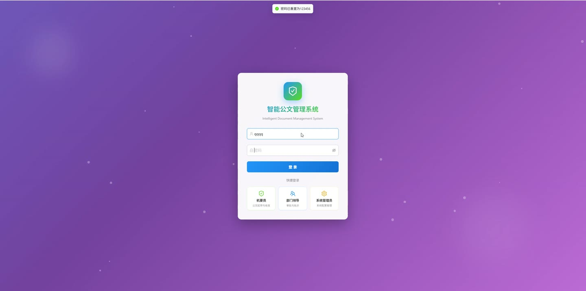
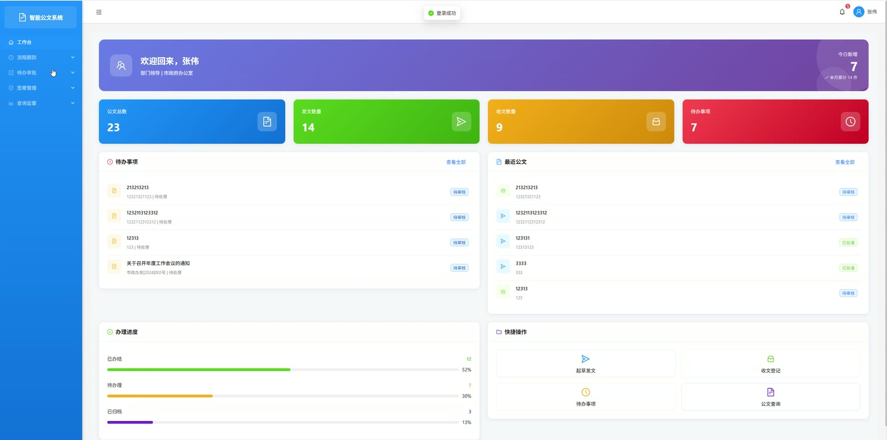
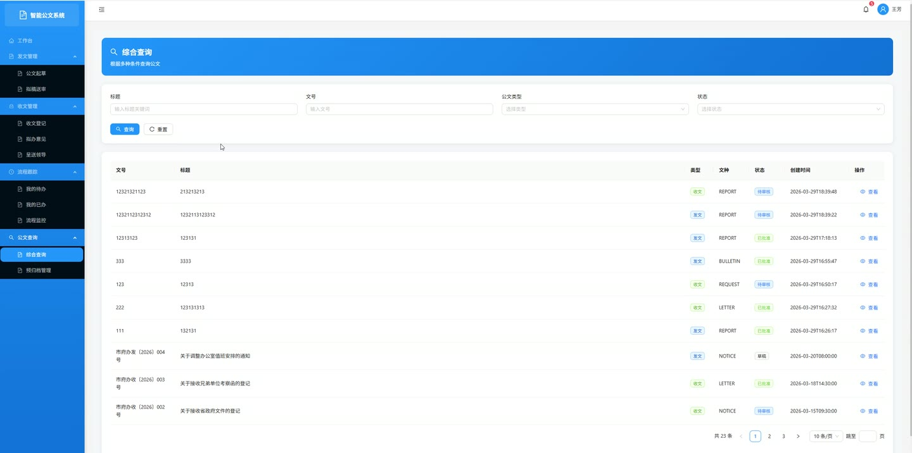
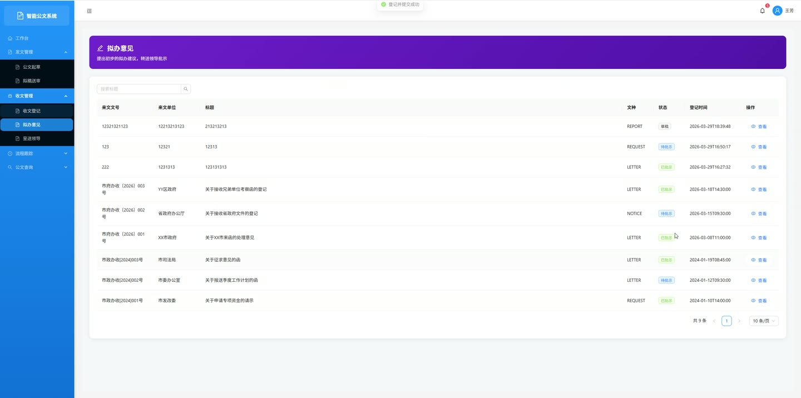
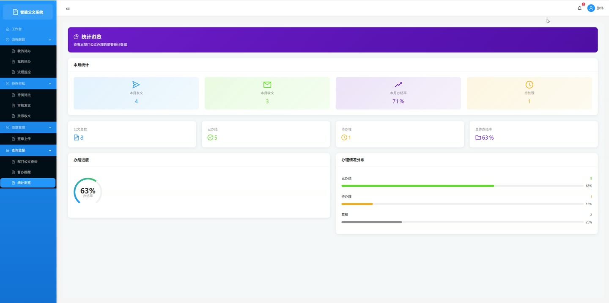
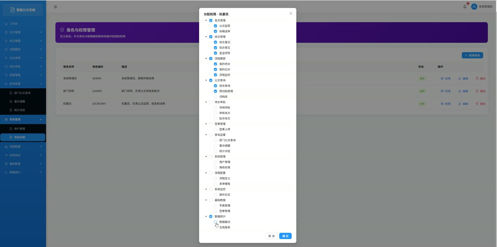

# (附文档)Springboot3+MySQL+React 公文管理系统

**技术栈**：Springboot3、React18、MySQL

### 系统简介

本系统是一套基于 Spring Boot 3 + React 18 前后端分离架构的公文全生命周期管理平台。系统涵盖公文起草、流转审批、签章管理、督办统计、数据备份等核心业务环节，支持多角色（普通用户、管理员）协同操作，适用于企事业单位的公文信息化管理场景。
 
### 核心功能
 
### 普通用户端

 
- 登录系统：通过用户名/密码认证登录，登录后获取 JWT Token、用户信息及动态菜单树 
- 起草公文：填写公文标题、文号、公文类型、密级、紧急程度、发文单位、正文内容，保存为草稿状态 
- 提交审核：将草稿公文提交至下一处理人，系统自动记录流转记录并生成待办事项 
- 查看公文列表：按标题/文号、公文类型、公文分类（发文/收文）、状态、部门、处理人等多条件组合筛选，分页展示 
- 查看公文详情：展示公文完整信息（含起草人、起草部门、当前处理人、类型名称、密级名称、紧急程度名称）及关联附件列表 
- 上传附件：为指定公文上传附件文件（支持多类型文件，最大 50MB），记录文件名、路径、大小、类型 
- 删除附件：删除公文附件时同步清理服务器存储文件 
- 查看流转记录：按创建时间升序查看某份公文的完整审批流转历史（处理人、操作、意见、下一处理人） 
- 待办事项管理：查看本人待处理公文列表（含公文标题、文号），支持查看已办结事项历史 
- 待办数量提醒：首页展示本人待办事项数量统计 
- 公文审批操作：对待办公文执行审批通过（可指定下一处理人）、退回（填写驳回意见）、归档操作，自动更新待办状态 
- 文件上传：通用文件上传接口，支持指定上传类型（附件/图片），返回文件访问路径 
- 图片上传：专用图片上传接口，上传至 images 子目录 
- 查看部门统计：查看本部门的公文总数、待审批数、已通过数、本月发文/收文数及月度完成率
 
### 管理员端

 
- 用户管理：分页查询用户列表（支持按用户名/真实姓名模糊搜索），新建用户（默认密码 123456），编辑用户信息，修改用户状态（启用/禁用），重置用户密码为 123456，删除用户 
- 角色管理：查看角色列表，新建/编辑/删除角色，为角色分配菜单权限（支持批量勾选菜单 ID） 
- 菜单管理：查看菜单列表，新建/编辑/删除菜单，获取完整菜单树（含父子层级关系） 
- 部门管理：查看部门列表，新建/编辑/删除部门（含部门名称、上级部门、排序、负责人、联系电话、状态） 
- 字典管理：管理字典类型（新建/编辑/删除），管理字典数据（新建/编辑/删除，按字典类型分组展示），根据字典类型查询启用状态的字典项（按排序号升序） 
- 印章管理：上传印章图片（支持个人印章/部门印章），编辑印章信息，删除印章（同步清理图片文件），查看印章列表 
- 流程定义管理：管理工作流定义（新建/编辑/删除），管理流程节点（新建/编辑/删除，指定节点名称、类型、处理角色、排序号），查看流程完整定义（含所有节点及处理角色名称） 
- 操作日志查询：分页查询系统操作日志（支持按用户名/操作内容模糊搜索），记录用户 ID、用户名、操作描述、请求方法、IP 地址、关联公文 ID 
- 数据备份：执行 MySQL 数据库备份（mysqldump），生成带时间戳的 .sql 备份文件，查看备份文件列表（按时间倒序，显示文件名、大小、备份时间），删除指定备份文件 
- 系统概览统计：查看公文总数、发文数、收文数、待审批数、已通过数、已归档数、今日公文数、本月公文数 
- 部门维度统计：按部门查看公文总数、待审批数、已通过数、本月发文/收文数、月度完成率
 
### 技术栈

 后端框架Spring Boot 3.x ORMMyBatis-Plus 权限认证Spring Security + JWT 前端框架React 18 状态管理React Context / Hooks 构建工具Vite 数据库MySQL 8.x 文件上传MultipartFile + 本地文件存储
 
### 交付内容

 
- 后端完整源码 
- 前端完整源码 
- 数据库初始化脚本 
- 万字文档

## 界面展示

---

## 获取完整源码 + 万字文档

本仓库为项目介绍页。**完整前后端源码、数据库初始化脚本、万字项目文档**，请加微信 `kangkangcode`，或访问 [codekk.top](http://codekk.top) 获取。

可作课程设计 / 毕业设计参考，支持远程部署调试。